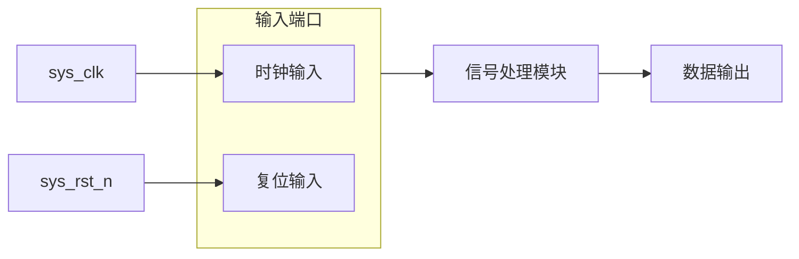
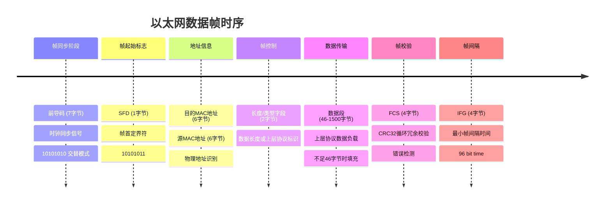

### 基本框架

```mermaid
flowchart LR
    subgraph InputPort [输入端口]
        CLK[时钟输入]
        RST[复位输入]
    end
    
    SYS_CLK[sys_clk] --> CLK
    SYS_RST[sys_rst_n] --> RST
    InputPort --> Processing[信号处理模块]
    Processing --> Output[数据输出]
```

```mermaid
timeline
    title 以太网数据帧时序
    
    帧同步阶段 : 前导码 (7字节)
               : 时钟同步信号
               : 10101010 交替模式
    
    帧起始标志 : SFD (1字节)
               : 帧首定界符
               : 10101011
    
    地址信息 : 目的MAC地址 (6字节)
             : 源MAC地址 (6字节)
             : 物理地址识别
    
    帧控制 : 长度/类型字段 (2字节)
           : 数据长度或上层协议标识
    
    数据传输 : 数据段 (46-1500字节)
             : 上层协议数据负载
             : 不足46字节时填充
    
    帧校验 : FCS (4字节)
           : CRC32循环冗余校验
           : 错误检测
    
    帧间隔 : IFG (4字节)
           : 最小帧间隔时间
           : 96 bit time
```

